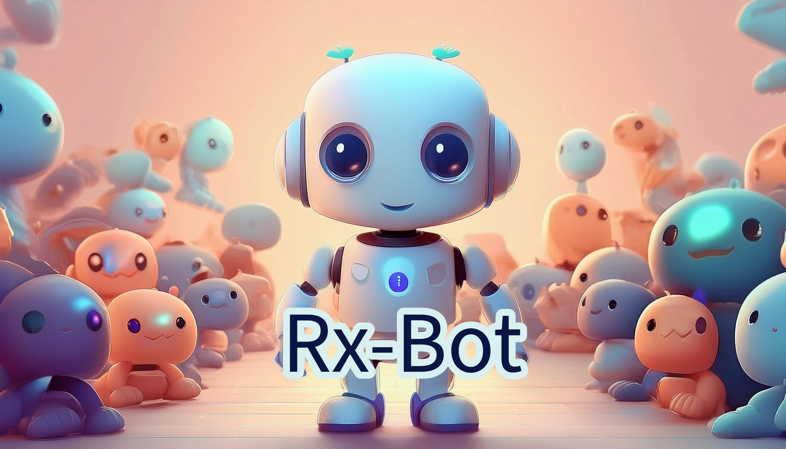

# RX-Bot: React-based Bot Framework for all Platforms

RX-Bot is an innovative framework for building bots using React inspired by Next.js. It combines the power of React's
component-based architecture with the flexibility of Bot API, allowing developers to create interactive and
dynamic bot interfaces with ease.

## Key Features

- React-based: Leverage the power and familiarity of React to build your bot's UI and logic.
- State Management: Built-in state management using a custom useState hook that supports remote state loading.
- Routing: Flexible routing system similar to Next.js, supporting dynamic routes.
- Suspense-like Functionality: Pause rendering while loading remote states, ensuring a smooth user experience.

## Supported Platforms

- Telegram
- WhatsApp(coming soon)
- Facebook Messenger(coming soon)
- Slack(coming soon)
- Discord(coming soon)

## Getting Started

### Installation

To create a new RX-Bot project, you can use the `create-rx-bot` package. This package will help you to create a `RxBot` instance.

```bash
pnpm create rx-bot
```

### Using the Latest rxbot CLI

The latest rxbot CLI can be used to build, develop, and deploy your RX-Bot projects. Here are some common commands:

- Build the application:
    ```bash
    rxbot build
    ```

- Run in development mode:
    ```bash
    rxbot dev
    ```

- Deploy the application:
    ```bash
    rxbot deploy
    ```

### Starting the Dev Server

To start the development server using the latest rxbot CLI, run the following command:

```bash
rxbot dev
```

### Example Project

For a complete example, you can refer to the `apps/example-bot` directory in this repository. It contains a sample bot project that demonstrates how to use the RX-Bot framework.

## Examples

Rx-Bot support both React Client Component and React Server Component. Here are some examples what you can do with
Rx-Bot

### Simple Counter

> Note: Key is required for storing and restore state from server.

```tsx
"use client";
import {useState} from "@rx-lab/storage";
import React from "react";

export default function Page() {
    // first argument is the key, second argument is the initial value
    // this is a little bit different from React's useState hook
    // because, we need to store the state on the server using the key.
    const [state, setState] = useState("counter", 0);

    return (
        <div>
            <h1>Welcome to the Telegram Bot!</h1>
            <hr/>
            <p>Choose an option</p>
            <hr/>
            <p>Current state: {state}</p>
            <menu>
                <div>
                    <button
                        key={"button1"}
                        onClick={() => {
                            setState(state + 1);
                        }}
                    >
                        +1
                    </button>
                    <button
                        key={"button2"}
                        onClick={() => {
                            setState(state - 1);
                        }}
                    >
                        -1
                    </button>
                </div>
                <div>
                    <button
                        key={"button3"}
                        onClick={() => {
                            setState(0);
                        }}
                    >
                        Reset
                    </button>
                </div>
            </menu>
        </div>
    );
}
```

### Chatbot

This example uses `ai` sdk from vercel to create a simple chatbot powered by ChatGPT.

> Note: This example is a demonstration on how server component can be used in a chatbot.

```tsx
import {openai} from "@ai-sdk/openai";
import {PageProps, RouteMetadata} from "@rx-lab/common";
import {generateText} from "ai";

export const metadata: RouteMetadata = {
    title: "AI",
    description: "Chat with AI",
    includeInMenu: true,
};

const model = openai.chat("gpt-4o-2024-08-06");

export default async function Page({text}: PageProps) {
    if (!text) {
        return <div>Hi! How can I help you?</div>;
    }
    const {text: assistantResponse} = await generateText({
        model,
        prompt: text,
    });
    return <div>{assistantResponse}</div>;
}
```

### Navigation

You can use our `Command` component to navigate between different pages.

```tsx
export default async function Page(props: PageProps) {
    const page = parseInt((props.searchQuery.page as any) ?? "1");
    const {posts, count, pageCount} = await fetchPosts(page);

    return (
        <div>
            <h1>Posts</h1>
            <p>There are {count} posts</p>
            <menu>
                {posts.map((post, index) => (
                    <div key={index}>
                        <CommandButton command={`/post/${post.id}`} renderNewMessage={true}>
                            {post.id + " - " + post.title}
                        </CommandButton>
                    </div>
                ))}
                <div key={"actions"}>
                    {page > 1 && (
                        <CommandButton command={`/post?page=${page - 1}`}>
                            Previous Page
                        </CommandButton>
                    )}
                    {page < pageCount && (
                        <CommandButton command={`/post?page=${page + 1}`}>
                            Next Page
                        </CommandButton>
                    )}
                </div>
            </menu>
        </div>
    );
}
```
